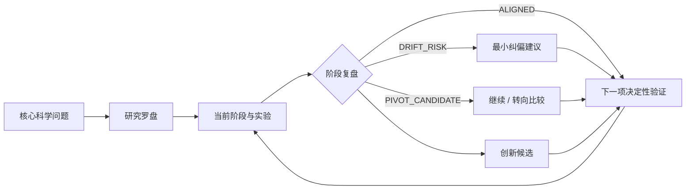

<div align="center">

**简体中文** · [English](./README_EN.md)

# 🧭 academic-program

**面向 Codex、Claude Code 等研究 Agent：长期跟踪科研目标、守住研究主线，并把每个阶段的证据转化为下一步与创新候选。**


轻量项目管理 · 方向漂移检测 · 阶段创新扫描 · 分层实验验收 · 主张—证据追踪

</div>

---

## 为什么需要它

长期科研最容易丢失的不是文件，而是研究判断：

- 当前工作还在回答最初的科学问题吗？
- 一个实验“数值没完全达标但改善明显”应该怎样诚实判定？
- 新现象只是偶然结果，还是值得验证的创新候选？
- 什么时候应该坚持，什么时候应该考虑转向？
- 论文中的每项主张能否回到实验、配置和结果？

`academic-program` 将这些判断维护在一个轻量、可续接的科研工作区中。它不会强制创建一整套管理文档，也不会为普通问答扫描整个项目。

## 兼容的 Agent

核心能力由标准的 `SKILL.md` 和按需加载的 `references/` 提供，不依赖某个模型或厂商专属运行时。

| 宿主 | 使用方式 | 宿主特有内容 |
| --- | --- | --- |
| Codex | 从用户级或项目级 Skills 目录发现，可用 `$academic-program` 显式调用 | `agents/openai.yaml` 提供可选的 OpenAI/Codex 界面元数据。 |
| Claude Code | 从个人 `~/.claude/skills/` 或项目 `.claude/skills/` 自动发现 | 不需要 `openai.yaml`；核心工作流仍由 `SKILL.md` 和引用文件提供。 |
| 其他 Agent Skills 兼容宿主 | 将完整 `academic-program/` 目录放入宿主支持的 Skills 位置 | 调用语法和安装路径以宿主文档为准。 |

同一个科研仓库可以被不同 Agent 使用。项目级稳定规则只维护一份正文；`AGENTS.md`、`CLAUDE.md` 等宿主入口按需保留简短适配或转向，避免规则分叉。

## 工作方式



Skill 只在续接项目、规划或总结实验、阶段转换和研究方向评估时加载相应规则。详细实验、方向和模板规则按需读取，避免无关上下文。

## 核心能力

| 能力 | 它会做什么 |
| --- | --- |
| 🧭 **研究罗盘** | 维护核心科学问题、目标主张、当前假设、范围边界和下一项决定性验证。 |
| 🛤️ **方向漂移检测** | 判断当前工作是主线、支撑、探索、漂移风险还是转向候选，并给出最小纠偏动作。 |
| 💡 **创新候选扫描** | 从机制、方法、验证、适用边界、负结果和工程能力中提炼潜力点。 |
| 🧪 **分层实验验收** | 区分 `STRICT_PASS`、`PRACTICAL_PASS`、`PARTIAL` 和 `FAIL`，不把单一阈值当作唯一结论。 |
| 🔗 **主张—证据追踪** | 将论文主张链接到实验记录、代码/配置、指标、图表和适用边界。 |
| 📦 **可复现实验记录** | 每次运行使用唯一 run-id，保留输入身份、配置、日志、指标和失败证据。 |
| 🧹 **克制的项目维护** | 复用已有入口，不重复建台账，不默认全仓扫描，不把清理变成交付门槛。 |
| 🔔 **事件触发提醒** | 在假设受损、方向漂移、证据越界或出现高价值候选时提醒；相同事项不重复刷屏。 |

## 方向状态

| 状态 | 含义 | 默认响应 |
| --- | --- | --- |
| `ALIGNED` | 直接降低核心问题的不确定性 | 继续，指出它推进了哪项验证。 |
| `SUPPORTING` | 必要的工具、数据、基线或可靠性工作 | 做到足够支持主线，避免无限扩张。 |
| `EXPLORATORY` | 有潜力，但尚未证明与主线相关 | 给出低成本判别实验或时间边界。 |
| `DRIFT_RISK` | 持续投入却没有推进核心问题 | 提醒偏离依据，并建议收敛、暂存或返回主线。 |
| `PIVOT_CANDIDATE` | 原假设受损，或旁支显示更强贡献 | 比较继续与转向的成本，提出最小决策实验。 |

方向检查不会机械阻止探索。证据支持转向时，Skill 会提出 `PIVOT_CANDIDATE`，但在用户决定前不会擅自改写核心目标。

## 分层实验验收

| 状态 | 判定 |
| --- | --- |
| `STRICT_PASS` | 所有预设软性能门槛满足，且没有硬否决项。 |
| `PRACTICAL_PASS` | 软门槛仅小幅未达，但差距有合理依据，方向正确，趋势或效果清晰，且没有明显副作用或样本挑选。 |
| `PARTIAL` | 有改善，但差距、稳定性或证据仍不足。 |
| `FAIL` | 没有明确改善、方向错误、超过合理容差，或触发硬否决项。 |

输入错误、数据泄漏、比较口径破坏、关键输出缺失等属于硬否决，不能由“趋势变好”覆盖。`PRACTICAL_PASS` 也必须公开目标值、实测值、差距、容差依据和未满足项。

## 案例

> 以下均为示意案例，用于展示 Skill 如何作出判断，不代表真实实验结果。

### 案例 1：数值轻微未达，但效果稳定提升

**输入**

- baseline RMSE：1.42
- 目标门槛：RMSE ≤ 1.00
- 实测结果：1.03
- 多个样本均优于 baseline，没有产品一致性或有效性否决

**Skill 判断**

```text
验收状态：PRACTICAL_PASS
依据：相对 baseline 改善 27.5%，仅比目标高 0.03，改善方向在主要样本上一致。
边界：不能写成“达到严格门槛”；需报告差距和容差依据。
下一步：在独立数据或重复运行中复核 1.00 附近的稳定性。
```

### 案例 2：支线逐渐偏离核心问题

**研究罗盘**

- 核心问题：能否从观测数据稳定估计一个共同系统参数
- 当前假设：该参数会产生可辨识且跨区域一致的响应
- 下一项决定性验证：检查不同区域下响应的方向和尺度是否一致

**现状**

团队连续数周优化可视化样式，但尚未完成跨区域一致性检查。

**Skill 提醒**

```text
方向状态：DRIFT_RISK
依据：当前工作改善展示质量，但没有降低“参数是否可辨识”的核心不确定性。
建议：冻结现有绘图样式，优先完成跨区域一致性检查；视觉优化转为 SUPPORTING。
```

### 案例 3：负结果暴露潜在创新边界

**现象**

方法在高信噪条件下稳定改善，但在低信噪条件下效果消失；该趋势在多个样本重复出现。

**Skill 输出**

| 字段 | 内容 |
| --- | --- |
| 潜在贡献 | 方法有效性可能由可观测性条件控制，可形成适用边界或机制解释。 |
| 当前证据 | 多样本呈现一致的高/低信噪差异。 |
| 关键缺口 | 尚未排除参数设置和评价偏差。 |
| 区别对象 | 常规“算法普遍有效”的解释及对应 baseline。 |
| 决定性验证 | 固定其他变量，仅扫描信噪水平并检查转折点。 |
| 状态 | `CANDIDATE`，尚不能声称学术新颖性。 |

## 文档策略

| 项目情况 | 默认入口 |
| --- | --- |
| 一次性咨询或分析 | 不创建管理文档 |
| 小型持续项目 | 当前宿主的 agent 指令文件（如 `AGENTS.md` 或 `CLAUDE.md`） |
| 持续科研项目 | 一份稳定 agent 指令入口；`PROJECT.md` 保存研究罗盘和当前状态 |
| 已有项目 | 复用现有入口，兼容旧结构，不自动迁移 |

Agent 指令文件只保存项目特有的目录、运行/验证入口和稳定约束。`PROJECT.md` 保存研究罗盘、当前阶段、近期任务、活跃创新候选、阻塞项和证据链接。详细实验历史独立保存，按需读取。

## 安装或更新

克隆仓库后，将完整的 `academic-program/` 目录复制到宿主支持的 Skills 位置：

| 宿主 | 用户级目录 | 项目级目录 |
| --- | --- | --- |
| Codex | `~/.agents/skills/academic-program` | `<repo>/.agents/skills/academic-program` |
| Claude Code | `~/.claude/skills/academic-program` | `<repo>/.claude/skills/academic-program` |

下面示例安装到用户级目录；每个代码块只执行与你的宿主对应的三行。

**PowerShell**

```powershell
# Codex
$skillTarget = Join-Path $env:USERPROFILE '.agents\skills\academic-program'
New-Item -ItemType Directory -Force -Path $skillTarget | Out-Null
Copy-Item -Path '.\academic-program\*' -Destination $skillTarget -Recurse -Force

# Claude Code
$claudeSkillTarget = Join-Path $env:USERPROFILE '.claude\skills\academic-program'
New-Item -ItemType Directory -Force -Path $claudeSkillTarget | Out-Null
Copy-Item -Path '.\academic-program\*' -Destination $claudeSkillTarget -Recurse -Force
```

**macOS / Linux**

```bash
# Codex
mkdir -p "$HOME/.agents/skills/academic-program"
cp -R ./academic-program/. "$HOME/.agents/skills/academic-program/"

# Claude Code
mkdir -p "$HOME/.claude/skills/academic-program"
cp -R ./academic-program/. "$HOME/.claude/skills/academic-program/"
```

## 使用示例

```text
使用 academic-program skill 续接这个科研项目，先核对研究罗盘，再判断当前工作是否偏离核心目标。
```

```text
使用 academic-program skill 总结本阶段实验：区分硬否决和软门槛，提炼创新候选，并给出下一项决定性验证。
```

```text
使用 academic-program skill 检查最近一个月的工作是否仍在推进核心科学问题；发现漂移时给出最小纠偏方案，不要自动修改研究目标。
```

```text
使用 academic-program skill 整理已有项目，复用现有文档和目录，不移动原始数据，不创建重复台账。
```

## 仓库结构

```text
README.md
README_EN.md
academic-program/
├── SKILL.md
├── agents/
│   └── openai.yaml  # 可选的 OpenAI/Codex 界面元数据
└── references/
    ├── direction-innovation.md
    ├── experiment-evidence.md
    └── project-doc-templates.md
```

- [Skill 入口与任务分流](academic-program/SKILL.md)
- [研究方向与创新复盘](academic-program/references/direction-innovation.md)
- [实验、验收与绘图规则](academic-program/references/experiment-evidence.md)
- [项目文档模板](academic-program/references/project-doc-templates.md)

## 设计原则

- **按需加载**：只读取当前任务需要的规则和证据。
- **目标稳定但允许转向**：防止无意识漂移，也允许证据驱动的正式转向。
- **提醒不等于等待**：除硬否决或重大范围决策外，提醒不会阻塞安全工作。
- **候选不等于创新成立**：项目内新现象必须经过证据和相关工作对照。
- **失败也是证据**：保留 RED、`PARTIAL`、`FAIL` 和有信息量的负结果。
- **文档服务决策**：不以文件数量、固定流程或形式化台账作为完成标准。
- **语言跟随项目**：按用户选择或项目既有主语言输出，不强制固定语言。

跨宿主结构依据 [OpenAI Docs：Build skills](https://learn.chatgpt.com/docs/build-skills) 和 [Claude Platform Docs：Agent Skills](https://platform.claude.com/docs/en/agents-and-tools/agent-skills/overview)；轻量化设计同时参考了 [Rethinking skills and prompts for GPT-6 Astra](https://developers.openai.com/blog/rethinking-skills-and-prompts-for-gpt-6-astra)。

## 提醒能力边界

Skill 会在相关任务被调用时，根据新证据和阶段变化及时提醒；它不会在没有运行任务时自行唤醒。若需要每周或每月主动复盘，应另外配置定时自动化。
