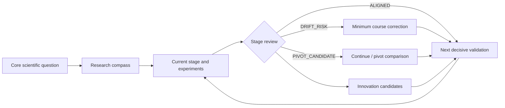

<div align="center">

[简体中文](./README.md) · **English**

# 🧭 academic-program

**A research-management Skill for Codex, Claude Code, and other compatible agents—keeping long-running work anchored to its core question and turning each stage of evidence into the next decision.**


Lightweight project management · Direction-drift detection · Stage-level innovation review · Layered experiment acceptance · Claim-to-evidence traceability

</div>

---

## Why it exists

What long-running research loses most easily is not files, but judgment:

- Is the current work still answering the original scientific question?
- How should an experiment be assessed when it narrowly misses a target but improves clearly?
- Is a new observation a coincidence, or a testable innovation candidate?
- When should the project stay the course, and when should it consider a pivot?
- Can every paper claim be traced back to experiments, configurations, and results?

`academic-program` maintains these decisions in a lightweight, resumable research workspace. It does not force a full documentation stack or scan the entire project for ordinary questions.

## Compatible agents

The core workflow is defined by a standard `SKILL.md` and progressively loaded `references/`. It does not depend on a provider-specific model or runtime.

| Host | How it is used | Host-specific content |
| --- | --- | --- |
| Codex | Discovered from user- or repository-level Skills directories; can be invoked explicitly as `$academic-program` | `agents/openai.yaml` provides optional OpenAI/Codex UI metadata. |
| Claude Code | Discovered from personal `~/.claude/skills/` or project `.claude/skills/` directories | Does not require `openai.yaml`; the core workflow remains in `SKILL.md` and its references. |
| Other Agent Skills-compatible hosts | Place the complete `academic-program/` directory in a supported Skills location | Invocation syntax and install paths follow the host's documentation. |

The same research repository can be used by multiple agents. Maintain one authoritative body of stable project rules; use `AGENTS.md`, `CLAUDE.md`, or other host entry points only as short adapters when needed, so the rules do not diverge.

## How it works



The skill loads the relevant rules only when resuming a project, planning or summarizing experiments, transitioning between stages, or evaluating research direction. Detailed experiment, direction, and template guidance remains progressively disclosed.

## Core capabilities

| Capability | What it does |
| --- | --- |
| 🧭 **Research compass** | Maintains the core scientific question, target claim, current hypothesis, scope boundaries, and next decisive validation. |
| 🛤️ **Direction-drift detection** | Classifies current work as aligned, supporting, exploratory, drift risk, or pivot candidate, then proposes the smallest useful correction. |
| 💡 **Innovation-candidate review** | Extracts potential contributions from mechanisms, methods, validation strategies, applicability boundaries, negative results, and reusable engineering capabilities. |
| 🧪 **Layered experiment acceptance** | Separates `STRICT_PASS`, `PRACTICAL_PASS`, `PARTIAL`, and `FAIL` instead of treating one numeric threshold as the whole conclusion. |
| 🔗 **Claim-to-evidence traceability** | Links paper claims to experiment records, code/configuration, metrics, figures, and validity boundaries. |
| 📦 **Reproducible experiment records** | Uses a unique run ID and preserves input identity, configuration, logs, metrics, and failure evidence. |
| 🧹 **Restrained project maintenance** | Reuses existing entry points, avoids duplicate ledgers and full-repository scans, and does not turn cleanup into a delivery gate. |
| 🔔 **Event-triggered reminders** | Warns when a hypothesis weakens, direction drifts, a claim exceeds its evidence, or a high-value candidate emerges—without repeating the same reminder. |

## Direction states

| State | Meaning | Default response |
| --- | --- | --- |
| `ALIGNED` | Directly reduces uncertainty in the core question | Continue and state which validation or claim it advances. |
| `SUPPORTING` | Necessary tooling, data, baseline, or reliability work | Continue until it is sufficient for the main line; avoid open-ended expansion. |
| `EXPLORATORY` | Potentially valuable, but not yet connected to the core question | Define a low-cost discriminating test or a time boundary. |
| `DRIFT_RISK` | Consumes effort without advancing the core question | Explain the evidence for drift and recommend converging, parking, or returning to the main line. |
| `PIVOT_CANDIDATE` | The original hypothesis is weakened, or a branch suggests a stronger contribution | Compare the cost of continuing versus pivoting and propose a minimum decision experiment. |

Direction review does not mechanically suppress exploration. When evidence supports a change, the skill raises a `PIVOT_CANDIDATE`, but it does not rewrite the core objective before the user decides.

## Layered experiment acceptance

| Status | Decision rule |
| --- | --- |
| `STRICT_PASS` | Every predefined soft performance gate is met and no hard veto is triggered. |
| `PRACTICAL_PASS` | A soft gate is missed only narrowly, the tolerance has a defensible basis, the direction and effect are clearly improved, and the result does not depend on a major side effect or cherry-picked samples. |
| `PARTIAL` | Improvement exists, but the gap, stability, or evidence is not sufficient for practical acceptance. |
| `FAIL` | No clear improvement, the direction is wrong, the result exceeds reasonable tolerance, or a hard veto is triggered. |

Invalid inputs, data leakage, broken comparison contracts, and missing critical outputs are hard vetoes. They cannot be overridden by a favorable trend. A `PRACTICAL_PASS` must still report the target, measured value, gap, tolerance rationale, and unmet condition.

## Examples

> All examples below are hypothetical. They demonstrate the skill's decision process and are not claims about real experiments.

### Example 1: A narrow numeric miss with a consistent effect

**Input**

- Baseline RMSE: 1.42
- Target: RMSE ≤ 1.00
- Measured result: 1.03
- The main samples all improve over baseline, with no product-consistency or scientific-validity veto

**Skill decision**

```text
Acceptance: PRACTICAL_PASS
Evidence: RMSE improves by 27.5% over baseline and misses the target by only 0.03;
the direction is consistent across the main samples.
Boundary: Do not report this as meeting the strict threshold. Report the gap and tolerance rationale.
Next step: Recheck stability around 1.00 on independent data or repeated runs.
```

### Example 2: A branch gradually drifts from the core question

**Research compass**

- Core question: Can a shared system parameter be estimated reliably from observations?
- Current hypothesis: The parameter produces an identifiable response that is consistent across regions.
- Next decisive validation: Check whether the response direction and scale agree across regions.

**Current situation**

The team has spent several weeks refining visualization styles, but the cross-region consistency check is still incomplete.

**Skill reminder**

```text
Direction: DRIFT_RISK
Evidence: The current work improves presentation quality but does not reduce uncertainty
about whether the parameter is identifiable.
Recommendation: Freeze the current figure style and complete the cross-region consistency check;
treat further visual refinement as SUPPORTING.
```

### Example 3: A negative result reveals a possible applicability boundary

**Observation**

The method improves consistently under high-SNR conditions but loses its effect at low SNR. The pattern repeats across multiple samples.

**Skill output**

| Field | Content |
| --- | --- |
| Potential contribution | The method may be governed by an observability condition, suggesting an applicability boundary or mechanism-level explanation. |
| Current evidence | Multiple samples show a consistent high-/low-SNR contrast. |
| Critical gap | Parameter-setting and evaluation bias have not yet been excluded. |
| Comparison target | The conventional explanation that the algorithm is broadly effective, plus the relevant baseline. |
| Decisive validation | Hold other variables fixed, sweep SNR only, and test for a transition point. |
| Status | `CANDIDATE`; academic novelty is not yet established. |

## Documentation strategy

| Project type | Default entry point |
| --- | --- |
| One-off consultation or analysis | Create no management document |
| Small ongoing project | The current host's agent instruction file, such as `AGENTS.md` or `CLAUDE.md` |
| Long-running research project | One stable agent-instruction entry point; `PROJECT.md` for the research compass and current state |
| Existing project | Reuse existing entry points and remain compatible with legacy structures; do not migrate automatically |

The agent instruction file stores only project-specific directories, run/validation entry points, and stable constraints. `PROJECT.md` stores the research compass, current stage, near-term tasks, active innovation candidates, blockers, and evidence links. Detailed experiment history remains separate and is loaded only when needed.

## Install or update

Clone the repository, then copy the complete `academic-program/` directory to a Skills location supported by your host:

| Host | User scope | Project scope |
| --- | --- | --- |
| Codex | `~/.agents/skills/academic-program` | `<repo>/.agents/skills/academic-program` |
| Claude Code | `~/.claude/skills/academic-program` | `<repo>/.claude/skills/academic-program` |

The examples below use user scope. In each code block, run only the three lines for your host.

**PowerShell**

```powershell
# Codex
$skillTarget = Join-Path $env:USERPROFILE '.agents\skills\academic-program'
New-Item -ItemType Directory -Force -Path $skillTarget | Out-Null
Copy-Item -Path '.\academic-program\*' -Destination $skillTarget -Recurse -Force

# Claude Code
$claudeSkillTarget = Join-Path $env:USERPROFILE '.claude\skills\academic-program'
New-Item -ItemType Directory -Force -Path $claudeSkillTarget | Out-Null
Copy-Item -Path '.\academic-program\*' -Destination $claudeSkillTarget -Recurse -Force
```

**macOS / Linux**

```bash
# Codex
mkdir -p "$HOME/.agents/skills/academic-program"
cp -R ./academic-program/. "$HOME/.agents/skills/academic-program/"

# Claude Code
mkdir -p "$HOME/.claude/skills/academic-program"
cp -R ./academic-program/. "$HOME/.claude/skills/academic-program/"
```

## Usage examples

```text
Use the academic-program skill to resume this research project. Check the research compass first,
then determine whether the current work has drifted from the core objective.
```

```text
Use the academic-program skill to summarize this experiment stage. Separate hard vetoes from soft gates,
identify innovation candidates, and propose the next decisive validation.
```

```text
Use the academic-program skill to review whether the last month of work still advances the core scientific
question. If it has drifted, propose the smallest correction without changing the research objective.
```

```text
Use the academic-program skill to organize this existing project. Reuse its documents and directories,
do not move raw data, and do not create duplicate ledgers.
```

## Repository layout

```text
README.md
README_EN.md
academic-program/
├── SKILL.md
├── agents/
│   └── openai.yaml  # optional OpenAI/Codex UI metadata
└── references/
    ├── direction-innovation.md
    ├── experiment-evidence.md
    └── project-doc-templates.md
```

- [Skill entry point and routing](academic-program/SKILL.md)
- [Direction and innovation review](academic-program/references/direction-innovation.md)
- [Experiment, acceptance, and figure rules](academic-program/references/experiment-evidence.md)
- [Project document templates](academic-program/references/project-doc-templates.md)

## Design principles

- **Progressive disclosure:** Read only the rules and evidence needed for the current task.
- **Stable objectives, evidence-driven pivots:** Prevent accidental drift while allowing a deliberate change of direction.
- **A reminder is not a waiting point:** Safe work continues unless a hard veto or material scope decision requires input.
- **A candidate is not established novelty:** A project-level observation still needs evidence and prior-work comparison.
- **Failure is evidence:** Preserve RED, `PARTIAL`, `FAIL`, and informative negative results.
- **Documents serve decisions:** File counts, fixed itineraries, and formal ledgers are not completion criteria.
- **Language follows the project:** The skill responds in the user's chosen language or the project's established primary language.

Cross-host structure follows [OpenAI Docs: Build skills](https://learn.chatgpt.com/docs/build-skills) and [Claude Platform Docs: Agent Skills](https://platform.claude.com/docs/en/agents-and-tools/agent-skills/overview). The lightweight design also draws on [Rethinking skills and prompts for GPT-6 Astra](https://developers.openai.com/blog/rethinking-skills-and-prompts-for-gpt-6-astra).

## Reminder boundary

The skill provides timely reminders when it is invoked and sees new evidence or a stage change. It does not wake itself when no task is running. Use a separate scheduled automation for weekly or monthly proactive reviews.
